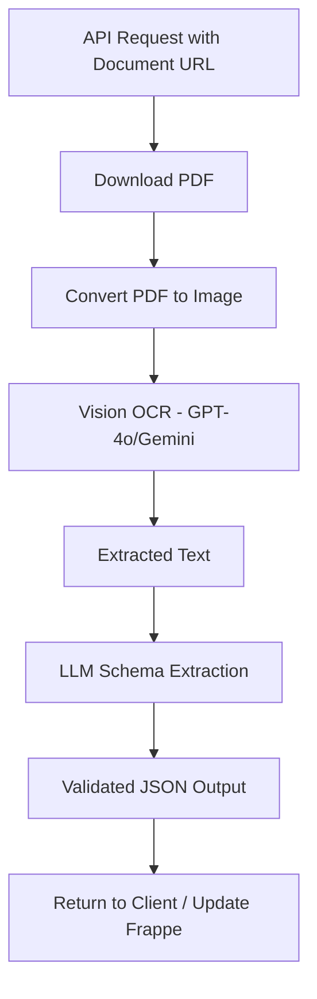

# 🧠 AI Document Schema Extractor

A production-grade FastAPI application to extract structured data from employee-related PDF documents using Vision AI OCR and LLMs. The system takes a **document URL**, performs **OCR** using **OpenAI GPT-4o** or **Google Gemini Vision**, and extracts **schema-aligned JSON**.

✅ **Integrated with [Frappe ERP](https://frappeframework.com/)** for real-world employee document automation.

---

## 🚀 Project Overview

This project automates information extraction from various employee-related documents (e.g., passports, visas, employment contracts, change status, residence permits, healthcare certifications). It processes document URLs (uploaded via Frappe) and returns structured data in JSON format.

### Key Features

- 🐳 **Docker-ready** - Easy deployment with Docker Compose
- 🚀 **FastAPI** - Modern, high-performance REST API
- 🔍 **Vision OCR** - OpenAI GPT-4o or Google Gemini Vision
- 📄 **Multi-format** - Supports PDF documents
- 🔗 **Frappe Integration** - Webhooks and API for Frappe ERP
- ✅ **Pydantic Validation** - Type-safe data schemas

---

## 📄 Document Flow



---

## 🧰 Technologies Used

| Component             | Tool/Library                             |
| --------------------- | ---------------------------------------- |
| **Framework**         | [FastAPI](https://fastapi.tiangolo.com/) |
| **Vision OCR**        | OpenAI GPT-4o, Google Gemini Vision      |
| **Containerization**  | Docker, Docker Compose                   |
| **Schema Validation** | [Pydantic](https://docs.pydantic.dev/)   |
| **PDF Handling**      | PyMuPDF (`fitz`), Pillow                 |
| **HTTP Client**       | httpx, aiohttp                           |
| **ERP Integration**   | Frappe REST API                          |

---

## 📦 Project Structure

```
ai-document-extractor/
├── app/
│   ├── __init__.py
│   ├── main.py                 # FastAPI application entry point
│   ├── config.py               # Configuration settings
│   ├── dependencies.py         # Dependency injection
│   │
│   ├── services/
│   │   ├── pdf_handler.py      # PDF download & image conversion
│   │   ├── vision_ocr.py       # OpenAI/Gemini Vision OCR
│   │   ├── extractor.py        # LLM schema extraction
│   │   └── frappe_client.py    # Frappe ERP API client
│   │
│   ├── schemas/
│   │   ├── documents.py        # Document Pydantic models
│   │   ├── requests.py         # API request schemas
│   │   └── responses.py        # API response schemas
│   │
│   ├── routes/
│   │   ├── extract.py          # Document extraction endpoints
│   │   ├── webhooks.py         # Frappe webhook handlers
│   │   └── health.py           # Health check endpoints
│   │
│   └── utils/
│       └── helpers.py          # Utility functions
│
├── Dockerfile
├── docker-compose.yml
├── requirements.txt
├── .env.example
└── README.md
```

---

## ✅ Supported Document Types

| Document Type             | Extracted Fields                                                            |
| ------------------------- | --------------------------------------------------------------------------- |
| Passport                  | passport_number, name, DOB, issue/expiry date, profession, nationality      |
| Visa (Tourism/Employment) | UID number, name, DOB, nationality, passport, profession, issue/valid dates |
| Change Status             | UID number, name, passport, employer, nationality, stamping deadline        |
| Employment Contract       | work_style, transaction_number, nationality, passport, DOB, qualification   |
| Residence                 | ID number, name, passport, profession, issue/expiry date                    |
| Healthcare Certificate    | DHA Unique ID, professional name                                            |
| Tenancy Contract          | tenant_name, property_no, start/end dates, license_no                       |

---

## � Quick Start with Docker

### 1. Clone the Repository

```bash
git clone https://github.com/your-repo/ai-document-extractor.git
cd ai-document-extractor
```

### 2. Configure Environment

```bash
# Copy example environment file
cp .env.example .env

# Edit .env with your API keys
nano .env
```

Required environment variables:

```env
# Choose OCR provider: "openai" or "gemini"
OCR_PROVIDER=openai

# API Keys (set the one for your chosen provider)
OPENAI_API_KEY=your_openai_api_key
GEMINI_API_KEY=your_gemini_api_key

# Frappe ERP Integration
FRAPPE_URL=https://your-frappe-instance.com
FRAPPE_API_KEY=your_frappe_api_key
FRAPPE_API_SECRET=your_frappe_api_secret
```

### 3. Build and Run

```bash
# Build and start the container
docker compose up -d

# View logs
docker compose logs -f

# Stop the container
docker compose down
```

### 4. Access the API

- **API Documentation**: http://localhost:8000/docs
- **Health Check**: http://localhost:8000/health

---

## 🔌 API Endpoints

### Health Check

```bash
GET /health
```

### Extract from URL

```bash
POST /api/v1/extract

{
  "document_url": "https://example.com/document.pdf",
  "document_id": "optional-id"
}
```

### Extract from Upload

```bash
POST /api/v1/extract/upload

# Form data:
# - file: PDF file
# - document_id: optional identifier
```

### Frappe Webhook

```bash
POST /api/v1/webhooks/frappe

{
  "event": "after_insert",
  "doctype": "Employee Document",
  "docname": "EMP-DOC-00001",
  "attachment_field": "document_file"
}
```

---

## 🔗 Frappe ERP Integration

### Setting up Webhooks in Frappe

For a detailed step-by-step guide on setting up the Frappe side, resolving permissions, and creating DocTypes, please refer to the [Integration Plan](INTEGRATION_PLAN.md).

1. Go to **Frappe > Webhook**
2. Create a new webhook:
   - **DocType**: Your document DocType (e.g., "Employee Document")
   - **Doc Event**: After Insert
   - **Request URL**: `http://your-api-server:8000/api/v1/webhooks/frappe`
   - **Request Structure**: JSON

### Webhook Payload

```json
{
  "event": "after_insert",
  "doctype": "Employee Document",
  "docname": "{{name}}",
  "document_url": "{{file_url}}",
  "attachment_field": "document_attachment"
}
```

### Field Mapping

The extractor will automatically update the Frappe document with extracted fields. Ensure your Frappe DocType has matching field names (e.g., `passport_number`, `name`, `date_of_birth`).

---

## 🧪 Example Output

```json
{
  "success": true,
  "document_id": "doc-123",
  "data": {
    "document_type": "Passport",
    "passport_details": {
      "passport_number": "A12345678",
      "name": "John Doe",
      "date_of_birth": "01/01/1990",
      "date_of_issue": "01/01/2020",
      "date_of_expiry": "01/01/2030",
      "nationality": "United States",
      "profession": "Engineer"
    }
  },
  "processing_time_ms": 2345.67
}
```

---

## � Development

### Run without Docker

```bash
# Create virtual environment
python -m venv venv
source venv/bin/activate  # On Windows: venv\Scripts\activate

# Install dependencies
pip install -r requirements.txt

# Run development server
uvicorn app.main:app --reload --port 8000
```

### Run with Docker (Development Mode)

```bash
# Run with hot-reload enabled
docker compose --profile dev up api-dev
```

---

## � Environment Variables

| Variable            | Description                                | Required               |
| ------------------- | ------------------------------------------ | ---------------------- |
| `OCR_PROVIDER`      | Vision OCR provider (`openai` or `gemini`) | Yes                    |
| `OPENAI_API_KEY`    | OpenAI API key                             | If using OpenAI        |
| `GEMINI_API_KEY`    | Google Gemini API key                      | If using Gemini        |
| `LLM_MODEL`         | Model for extraction (e.g., `gpt-4o`)      | No                     |
| `FRAPPE_URL`        | Frappe instance URL                        | For Frappe integration |
| `FRAPPE_API_KEY`    | Frappe API key                             | For Frappe integration |
| `FRAPPE_API_SECRET` | Frappe API secret                          | For Frappe integration |
| `CORS_ORIGINS`      | Allowed CORS origins                       | No                     |
| `DEBUG`             | Enable debug mode                          | No                     |

---

## 📋 Notes

- The Vision OCR approach eliminates the need for local GPU resources
- OpenAI GPT-4o provides excellent OCR accuracy for most documents
- Gemini Vision is a cost-effective alternative with good accuracy
- All dates are normalized to DD/MM/YYYY format

---

## 👨‍💻 Author

- **Mohammed Khalaf**
  > Embedded & AI Developer

[GitHub](https://github.com/Mohammedkh97) | [LinkedIn](https://www.linkedin.com/in/mohammed-khalaf97/)

---

## 📄 License

This project is licensed under the Apache License 2.0 - see the [LICENSE](LICENSE) file for details.
